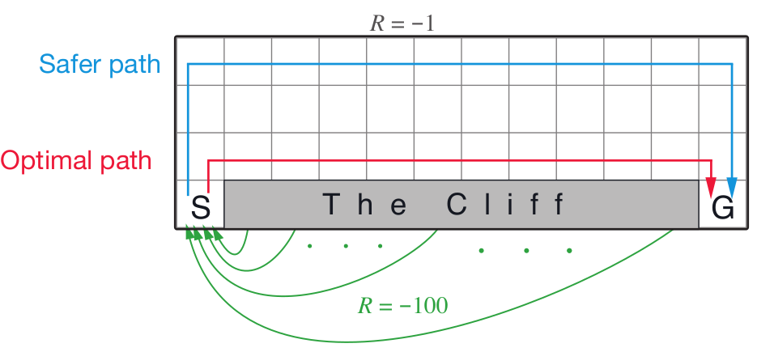

# CliffWalk

## Environment:
This is a simple implementation of the Gridworld Cliff  reinforcement learning task.   Adapted from Example 6.6 (page 106) from Reinforcement Learning: An Introduction by Sutton and Barto: http://incompleteideas.net/book/bookdraft2018jan1.pdf
 With inspiration from: https://github.com/dennybritz/reinforcement-learning/blob/master/lib/envs/cliff_walking.py 
The board is a 4x12 matrix, with (using NumPy matrix indexing): 
&nbsp;&nbsp;&nbsp;o	[3, 0] as the start at bottom-left 
&nbsp;&nbsp;&nbsp;o	[3, 11] as the goal at bottom-right 
&nbsp;&nbsp;&nbsp;o	[3, 1..10] as the cliff at bottom-center 
Each time step incurs -1 reward, and stepping into the cliff incurs -100 reward and a reset to the start. An episode terminates when the agent reaches the goal. 

From Sutton and Barto's Reinforcement Learning: An Introduction textbook

Example 6.6: Cliff Walking This gridworld example compares Sarsa and Q-learning, highlighting the difference between on-policy (Sarsa) and off-policy (Q-learning) methods. Consider the gridworld shown below. This is a standard undiscounted, episodic task, with start and goal states, and the usual actions causing movement up, down,right, and left. Reward is -1 on all transitions except those into the region marked “The Cliff”. Stepping into this region incurs a reward of -100 and sends the agent instantly back to the start.
