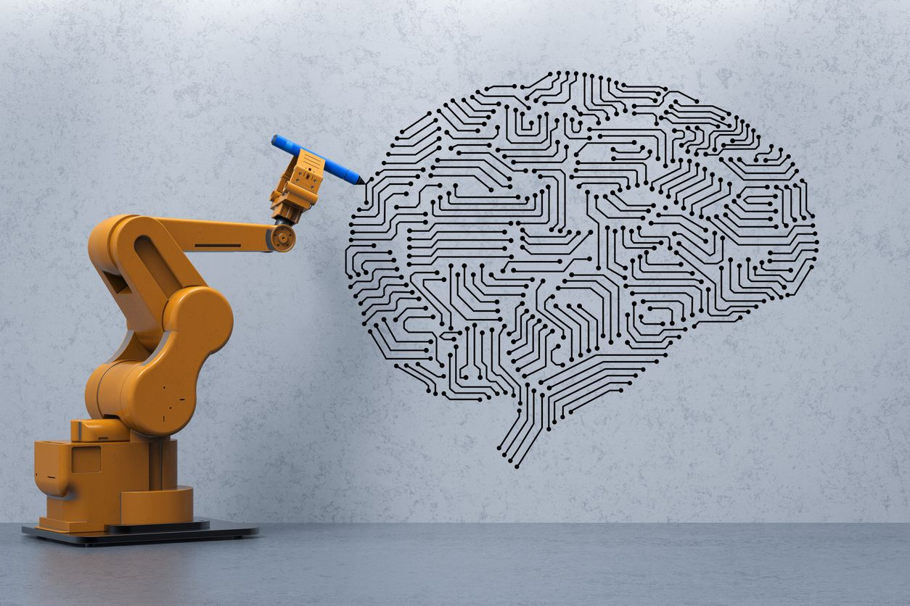

# Reinforcement Learning

Reinforcement learning (RL) is an area of machine learning concerned with how intelligent agents ought to take actions in an environment in order to maximize the notion of cumulative reward. Reinforcement learning is one of three basic machine learning paradigms, alongside supervised learning and unsupervised learning.

Personally, for me, what excites me about RL is its application in automation and more varied robotic functions

## Project Sources
Programming assignments from University of Alberta's Reinforcement Learning Specialization  
Capstone Project (Lunar Lander) from University of Alberta's Reinforcement Learning Specialization 
[Gym from OpenAI](https://gym.openai.com/) 
Gym is a toolkit for developing and comparing reinforcement learning algorithms. It supports teaching agents everything from walking to playing games like Pong or Pinball. 

## Learning:
### Foundations
Markov's Reward Process, Markov's Decision Process and Bellman's Equations and Bellman's optimal equations 
Modelling k-Armed Bandits 
Value functions (State Value Function and Action Value Function) 
Exploration vs. Exploitation vs. e-Greedy functions  

### Solving Bellman's and Bellman's optimization functions:
With Model and Model-free 
Prediction vs. Control - Policy Iteration / Value Iteration - TD vs. SARSA, e-SARSA and Q-learning 
On-policy vs off-policy model 

### Solving large state / continuous states
Functional approximation 
Discretization 
Coarse and Tile coding 
DQN 

*Image Credit: https://www.cdotrends.com/
